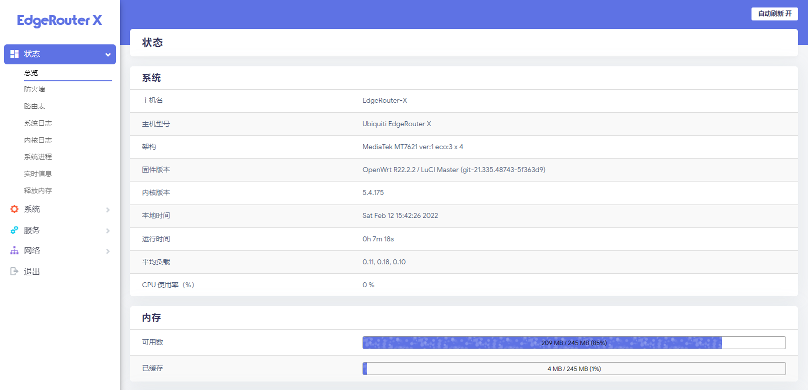

English | [简体中文](README.zh-CN.md)

    

    
    
    
    

    <a href="https://github.com/seatonjiang/openwrt-ubnt/issues">Report Bug</a>
    ·
    <a href="https://github.com/seatonjiang/openwrt-ubnt/issues">Request Feature</a>

OpenWrt Firmware for UBNT Routers (Nightly Builds)

## 💻 Firmware Preview

    

## ✨ About Firmware

- OpenWrt firmware for UBNT ER-X and ER-X-SFP devices.
- Firmware is automatically compiled and updated daily with the project source code to ensure the latest version is always available.
- Supports IPv4 and Ipv6 by default, and BBR congestion control algorithm (routes can run at full speed).
- Optimized for small memory devices and streamlined with many useless features (install as needed).
- Includes a large number of official OpenWrt plugins and community plugins, the software source has been accelerated using domestic sources.

There are many `features` not listed, you can upgrade to experience the firmware features.

## 🚀 Quick start

Download the latest firmware from the [Releases](https://github.com/seatonjiang/openwrt-ubnt/releases) page, and then refer to the firmware burning method "ER-X Burning Firmware via TTL".

## 🤝 Contributing

We welcome all contributions. You can submit any ideas as pull requests or as issues, have a good time! :)

## 📃 License

The project is released under the MIT License, see the [LICENCE](https://github.com/seatonjiang/openwrt-ubnt/blob/main/LICENSE) file for details.