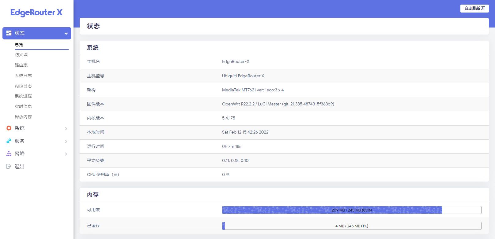

[English](README.md) | 简体中文

    

    
    
    
    

    <a href="https://github.com/seatonjiang/openwrt-ubnt/issues">报告问题</a>
    ·
    <a href="https://github.com/seatonjiang/openwrt-ubnt/issues">功能需求</a>

UBNT 路由器的 OpenWrt 固件（夜间构建）

## 💻 固件预览

    

## ✨ 固件介绍

- 适用于 UBNT 旗下 ER-X 和 ER-X-SFP 设备的 OpenWrt 固件
- 固件跟随项目源码每日自动编译更新，确保随时获得最新版本
- 默认支持 IPv4 和 Ipv6，并支持 BBR 拥塞控制算法（路由可以跑满速）
- 针对小内存设备进行了优化，精简了许多没用的功能（根据需要自行安装）
- 包含了丰富的 OpenWrt 原版插件及社区插件源

还有很多 `特性` 没有被列举出来，可以自行升级体验一下固件功能。

## 🚀 使用说明

首先在 [Releases](https://github.com/seatonjiang/openwrt-ubnt/releases) 页面下载最新固件，然后参考固件的烧录方法《ER-X 通过 TTL 烧录固件》。

## 🤝 参与共建

我们欢迎所有的贡献，你可以将任何想法作为 pull requests 或 issues 提交，顺颂商祺 :)

## 📃 开源许可

项目基于 MIT 许可证发布，详细说明请参阅 [LICENCE](https://github.com/seatonjiang/openwrt-ubnt/blob/main/LICENSE) 文件。